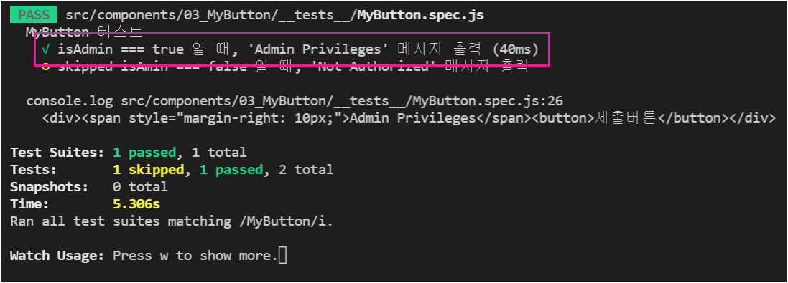

##### top
# Vue Test Utils 스터디

``Vue Test Utils`` 는 Vue 프레임워크의 공식 테스트 라이브러리 입니다.

함께 사용할 테스트 프레임워크는 ``Jest`` 입니다.

테스트를 위한 환경설정은 Vue CLI 로 프로젝트 생성 시, Test 항목을 선택하면 의존성 설치와 함께 설정해 줍니다.

<br/>

01. [Jest의 기본](#01)

02. [expect() 함수의 Matchers: ``JestMatchers``](#02)

03. [mount() 와 shallowMount()](#03)

04. [컴포넌트의 props 테스트](#04)

05. [wrapper 생성을 위한 Factory 함수](#05)

06. [``computed`` 테스트](#06)

07. [Event 테스트](#07)


<br/>

[🔺 Top](#top)

<hr/><br/>


##### 01
## 01. Jest의 기본

Jest 는 Javascript 의 대표 테스트 프레임워크 중 하나 입니다.

Jest 의 테스트 유닛 작성 구조는 다음과 같습니다.

* ``describe()``: 테스트 개요 (중첩 가능)
* ``it()``: 테스트 케이스

<br/>

아래 코드는 describe() 와 it() 을 사용한 예시 입니다.

```javascript
// <rootDir>/tests/unit/myTest.spect.js

describe("테스트 개요 입니다.", () => {
  it("테스트 케이스 01", () => {
    // 테스트 코드
  });

  it("테스트 케이스 02", () => {
    // 테스트 코드
  });
});
```

<br/>

이제 실제 테스트 케이스를 Assertion 하는 방법에 대해 알아보겠습니다.

``it()`` 의 callback 으로 넘겨주는 함수가 실제 테스트가 되는 코드이며, ``expect()`` 함수를 사용하여, 테스트 통과 여부를 검사할 수 있습니다.

아래 코드는 ``expect()`` 사용 예시 입니다.

```javascript
// <rootDir>/tests/unit/myTest.spect.js

describe("테스트 개요", () => {
  it("1 + 1 === 2", () => {
    expect(1 + 1).toBe(2);
  });
});
```


<br/>

[🔺 Top](#top)

<hr/><br/>


##### 02
## 02. expect() 함수의 Matchers: ``JestMatchers``

``expect()`` 함수는 ``JestMatchers`` 객체를 반환 합니다.

``JestMatchers`` 객체에는 Assertion 을 위한 여러가지 메서드를 제공하고 있습니다.

다음 항목들은 ``JestMatchers`` 객체의 Assertion 메서드 입니다. (대상: expect(대상))

* toBe(인자): ``expect(대상)`` 의 대상값을 검사합니다. ``대상 === 인자``일 때, 테스트를 통과 합니다.
* toBeTruthy(): ``대상 === true`` 일 때, 테스트를 통과 합니다.
* toBeFalsy(): ``대상 === false`` 일 때, 테스트를 통과 합니다.
* toBeDefined(): ``대상 !== undefined`` 일 때, 테스트를 통과 합니다.
* toBeUndefined(): ``대상 === undefined`` 일 때, 테스트를 통과 합니다.
* toBeNull(): ``대상 === null`` 일 때, 테스트를 통과 합니다.
* toBeNaN(): ``대상 === "NaN"`` 일 때, 테스트를 통과 합니다.
* toBeInstanceOf(인자): ``대상 instanceof 인자`` 일 때, 테스트를 통과 합니다.
* toBeCloseTo(인자): ``대상(부동소수점) === 인자(부동소수점)`` 일 때, 테스트를 통과 합니다. (부동소수점 연산 오차를 고려한 비교 입니다.)
* toContain(인자): ``대상(HTML요소) 자식요소 === 인자(HTML 문자열)`` 일 때, 테스트를 통과 합니다.
* toEqual(객체): ``대상(객체)의 모든 속성 === 인자(객체)의 모든 속성`` 일 때, 테스트를 통과 합니다. (Deep 검사)
* toStrictEqual(객체): ``대상(객체)의 모든 속성 === 인자(객체)의 모든 속성`` 이며, ``동일한 생성자`` 일 때, 테스트를 통과 합니다. (Deep 검사)


<br/>

[🔺 Top](#top)

<hr/><br/>


##### 03
## mount() 와 shallowMount()

Vue 컴포넌트를 테스트 하기 위해서는, 실제 DOM 에 Mount 되어야 할 수 있지만, Vue Test Utils 에서는 가상의 Mount 함수를 제공하고 있습니다.

테스트용 Mount는 두가지 방법이 있습니다.

* ``mount()``
* ``shallowMount()``

<br/>

``mount()`` 와 ``shallowMount()`` 는 둘 다 Mount 기능을 하지만, 차이점은 다음과 같습니다.

* mount(): Mount 대상 컴포넌트의 모든 의존성을 포함 합니다.
* shallowMount(): 의존 컴포넌트를 모두 ``Stub`` 객체로 대체 합니다.

<br/>

아래 코드는 Parent 컴포넌트가 Child 컴포넌트에 의존하는 형식 입니다.

Parent 컴포넌트를 사용하여, mount() 와 shallowMount() 를 비교하면 다음과 같은 결과를 얻을 수 있습니다.

<br/>

```html
<!-- Child.vue -->
<!-- 경로: "@/components/02_Mount/Child.vue -->

<script>
export default {
  render() {
    return <div>Child Component</div>;
  },
};
</script>
```

```html
<!-- Parent.vue -->
<!-- 경로: "@/components/02_Mount/Parent.vue" -->

<script>
import Child from "./Child.vue";

export default {
  render() {
    return (
      <div>
        <Child />
      </div>
    );
  },
};
</script>
```

```javascript
// 경로: "@/components/02_Mount/__tests__/Mount.spec.js"

import { mount, shallowMount } from "@vue/test-utils";
import Parent from "../Parent.vue";

describe("02 Mount", () => {
  it("Parent 컴포넌트의 html() 비교", () => {
    const shallowWrapper = shallowMount(Parent);
    const mountWrapper = mount(Parent);

    console.log(shallowWrapper.html());
    console.log(mountWrapper.html());
  });
});
```

<br/>

<br/>

<br/>

위의 결과를 보면, shallowMount() 과 mount() 의 html() 결과가 다르다는 것을 알 수 있습니다.

mount() 를 사용하게 되면, 모든 의존성 컴포넌트를 그대로 사용합니다.

반면, shallowMount() 를 사용하면, 의존성 컴포넌트를 ``<anonymous-stub>``으로 대체하여 사용하게 됩니다.

즉, shallowMount() 는 해당 컴포넌트만을 테스트할 수 있도록 고립된 상태로 Mount 합니다.


<br/>

[🔺 Top](#top)

<hr/><br/>


##### 04
## 04. 컴포넌트의 props 테스트

컴포넌트의 ``props`` 는 부모 컴포넌트로 부터 전달받는 데이터 입니다.

``props`` 를 테스트하기 위해서는, mount() 또는 shallowMount() 호출 시, options 객체에 props를 Mock데이터로 넘겨주어 테스트할 수 있습니다.

```typescript
interface mount {
  (Vue생성자: VueConstructor, options: object): Wrapper,
}

interface shallowMount {
  (Vue생성자: VueConstructor, options: object): Wrapper,
}
```

<br/>

| 공식문서: https://vue-test-utils.vuejs.org/api/options.html#propsdata

<br/>

``options`` 객체에는 ``propsData`` 속성이 있으며, Vue 컴포넌트의 Props에 데이터를 넘겨줄 수 있습니다.

아래 코드는 props 를 테스트하기 위한 MyButton 컴포넌트 입니다.

```html
<script>
export default {
  name: "MyButton",

  props: {
    msg: {
      type: String,
      required: true,
    },

    isAdmin: {
      type: Boolean,
      default: false,
    },
  },

  render() {
    const span = this.isAdmin ? "Admin Privileges" : "Not Authorized";

    return (
      <div>
        <span style="margin-right: 10px;">{span}</span>
        <button>{msg}</button>
      </div>
    );
  },
};
</script>
```

<br/>

첫번째 테스트 케이스는 ``isAmin`` 값이 ``false`` 일 때, 테스트 입니다.

```javascript
// 경로: "@/components/03_MyButton/__tests__/MyButton.spec.js"

import { shallowMount } from "@vue/test-utils";
import MyButton from "@/components/03_MyButton/MyButton.vue";

describe("MyButton 테스트", () => {
  it("isAmin === false 일 때, 'Not Authorized' 메시지 출력", () => {
    const wrapper = shallowMount(MyButton, {
      propsData: {
        msg: "제출",
      },
    });

    console.log(wrapper.html());

    expect(wrapper.find("span").text()).toBe("Not Authorized");
    expect(wrapper.find("button").text()).toBe("제출");
  });
});
```

<br/>

위의 테스트 실행 결과, props로 넘겨준 msg가 테스트 통과된 것을 알 수 있습니다.

<br/>

<br/>

이제 두번째 테스트로 ``isAdmin`` 값이 ``true`` 일 때, 테스트 입니다.

```javascript
// 경로: "@/components/03_MyButton/__tests__/MyButton.spec.js"

import { shallowMount } from "@vue/test-utils";
import MyButton from "../MyButton.vue";

describe("MyButton 테스트", () => {
  it("isAdmin === true 일 때, 'Admin Privileges' 메시지 출력", () => {
    const wrapper = shallowMount(MyButton, {
      propsData: {
        msg: "제출버튼",
        isAdmin: true,
      },
    });

    console.log(wrapper.html());

    expect(wrapper.find("span").text()).toBe("Admin Privileges");
    expect(wrapper.find("button").text()).toBe("제출버튼");
  });
});
```

<br/>

위의 테스트 결과 역시 통과한 것을 알 수 있습니다.

<br/>

<br/>


<br/>

[🔺 Top](#top)

<hr/><br/>


##### 05
## 05. wrapper 생성을 위한 Factory 함수

wrapper 객체를 생성하기 위해, 지금까지는 각 테스트 케이스에서 shallowMount() 또는 mount() 를 사용하였습니다.

하지만, 이 코드는 반복 코드로 ``DRY (Don't Repeat Yourself)`` 원칙에 위배됩니다.

따라서 다음과 같이 wrapper 객체를 반환하는 ``factory`` 함수를 작성하면 좋습니다.

```javascript
import MyButton from "../MyButton.vue";
import { shallowMount } from "@vue/test-utils";

const factoryForMyButton = props => {
  return shallowMount(MyButton, {
    propsData: {
      ...props,
    },
  });
};

describe("MyButton 테스트", () => {
  it("isAdmin === false 테스트", () => {
    const wrapper = factoryForMyButton({
      msg: "제출Button",
    });

    expect(wrapper.find("span").text()).toBe("Not Authorized");
    expect(wrapper.find("button").text()).toBe("제출Button");
  });

  it("isAdmin === true 테스트", () => {
    const wrapper = factoryForMyButton({
      msg: "제출버튼",
      isAdmin: true,
    });

    expect(wrapper.find("span").text()).toBe("Admin Privileges");
    expect(wrapper.find("button").text()).toBe("제출버튼");
  });
});
```

<br/>

<br/>

<br/>

wrapper 객체를 만들기 위한 factoryForMyButton() 을 사용하여 동일한 테스트를 할 수 있게 되었습니다.

이로써, DRY 원칙을 만족하는 테스트 유닛을 작성할 수 있게 되었습니다.


<br/>

[🔺 Top](#top)

<hr/><br/>


##### 06
## 06. ``computed`` 테스트

computed 는 내부 로직에 따라 값을 반환하는 getter 입니다.

computed 를 테스트하는 방법은 두가지가 있습니다.

* wrapper 를 사용한 테스트
* Function.prototype.call() 을 사용한 테스트

<br/>

아래의 코드는 이번 테스트를 위한 NumberList 컴포넌트 입니다.

``props.isOdd === true`` 일 때, computed.numberList 는 ``"1, 3, 5, 7, 9"`` 를 반환 합니다.
``props.isOdd ===false`` 일 때, computed.numberList 는 ``"0, 2, 4, 6, 8"`` 을 반환 합니다.

```html
<!-- NumberList.vue -->
<!-- 경로: "@/components/04_NumberList/NumberList.vue -->

<script>
export default {
  props: {
    isOdd: {
      type: Boolean,
      default: false,
    },
  },

  computed: {
    numberList() {
      return Array.from({ length: 10 }, (_v, i) => i)
        .filter(v => !!(v % 2) === this.isOdd)
        .join(", ");
    },
  },

  render() {
    return <div>{this.numberList}</div>;
  },
};
</script>
```


<br/><br/>


### 06-01. ``wrapper`` 를 사용한 ``computed`` 테스트

``wrapper`` 를 사용한 방법은 기존과 동일합니다.

``wrapper`` 를 생성할 때 ``props`` 를 넘겨주고, ``computed`` 결과값을 확인합니다.

```javascript
// 경로: "@/components/04_NumberList/__tests__/NumberList.spec.js"

import NumberList from "../NumberList.vue";
import { shallowMount } from "@vue/test-utils";

describe("NumberList 테스트", () => {
  it("isOdd === false, 짝수 출력", () => {
    const wrapper = shallowMount(NumberList);

    expect(wrapper.text()).toBe("0, 2, 4, 6, 8");
  });

  it("isOdd === true, 홀수 출력", () => {
    const wrapper = shallowWrapper(NumberList, {
      propsData: {
        isOdd: true,
      },
    });

    expect(wrapper.text()).toBe("0, 2, 4, 6, 8");
  });
});
```

<br/>

위의 테스트 결과, 의도한 결과를 얻을 수 있습니다.

<br/>


<br/><br/>


### 06-02. ``Function.prototype.call()`` 을 사용한 ``computed`` 테스트

이번에는 ``computed`` 테스트에 wrapper 를 사용하지 않고, ``Function.prototype.call()`` 을 사용해 보겠습니다.

``call()`` 메서드의 첫번째 인자는 ``thisArg`` 입니다.

메서드를 실행할 때, 사용할 ``this 객체`` 를 직접 주입하여 실행할 수 있습니다.

<br/>

```javascript
// 경로: "@/components/04_NumberList/__tests__/NumberList2.spec.js"

import NumberList from "../NumberList.vue";

describe("NumberList 테스트", () => {
  it("isOdd === false 일 때, 짝수 출력", () => {
    const thisArg = { isOdd: false };

    expect(NumberList.computed.numberList.call(thisArg)).toBe("0, 2, 4, 6, 8");
  });

  it("isOdd === true 일 때, 홀수 출력", () => {
    const thisArg = { isOdd: true };

    expect(NumberList.computed.numberList.call(thisArg)).toBe("1, 3, 5, 7, 9");
  });
});
```

<br/>

<br/>


<br/><br/>


### 06-03. ``wrapper`` 방식과 ``call`` 방식 비교

``wrapper`` 방식의 ``computed`` 테스트는 기존의 방법과 동일 합니다.

``call`` 을 사용해도 동일한 테스트를 할 수 있습니다.

일반적으로는 ``wrapper`` 를 사용한 테스트를 작성하지만, 테스트할 ``computed`` 만 단독으로 테스트할 경우, ``call`` 을 사용하면 간단하게 테스트를 작성할 수 있습니다.

그리고 ``call`` 을 사용하면, Mount 과정이 없기 때문에 ``Vue Life Cycle`` 이 실행되지 않고 테스트가 되므로, 좀 더 빠른 테스트가 가능합니다.

<br/>

``wrapper`` 와 ``call`` 어떤것을 사용해도 테스트가 되기 때문에, 적절히 선택하면 됩니다.


<br/>

[🔺 Top](#top)

<hr/><br/>


###### 07
## 07. Event 테스트

Event 는 비동기 처리를 위한 방법 중 하나 입니다.

이번에는 버튼을 클릭했을 때의 동작을 테스트 해보겠습니다.

아래의 코드는 ``<form>`` 형식의 컴포넌트 이며, 동작은 다음과 같습니다.

* 사용자가 문자열을 입력합니다.
* ``제출 버튼``을 클릭하면, 메시지가 출력 됩니다.

<br/>

```html
<!-- 경로: "@/components/05_MyForm/MyForm.vue -->

<script>
export default {
  data: () => ({
    userName: '',
    isFinished: false,
  }),

  methods: {
    onInput(e) {
      this.userName = e.target.value;
    },

    submitHandler(e) {
      e.preventDefault();
      this.isFinished = true;
    },
  },

  render() {
    return (
      <div>
        <form on-submit={this.submitHandler}>
          <input 
            type="text" 
            value={this.userName} 
            on-input={this.onInput} 
            data-user-name
          />
          <input type="submit" value="제출하기">
        </form>

        {this.isFinished ? (
          <div class="form-msg">안녕하세요, ${this.userName}님</div>
        ) : (
          ""
        )}
      </div>
    );
  },
};
</script>
```

<br/>

위의 코드에서 사용되는 이벤트는 다음고 같습니다.

* ``input`` 이벤트: 사용자가 문자열 입력 시 마다 발생
* ``submit`` 이벤트: 사용자가 ``제출하기`` 버튼 클릭 시 발생

<br/>

아래의 코드는 ``submit`` 버튼을 클릭했을 때, 결과를 사용한 테스트 유닛 입니다.

```javascript
// 경로: "@/components/05_MyForm/__tests__/MyForm.spec.js"

import MyForm from "../MyForm.vue";
import { shallowMount } from "@vue/test-utils";

describe("MyForm 테스트", () => {
  it("'제출하기' 버튼 클릭 시, 메시지 출력", async () => {
    const wrapper = shallowMount(MyForm, {
      attachTo: document.body,
    });

    wrapper.find("[data-user-name]").element.value = "Alice";
    await wrapper.find("[data-user-name]").trigger("input");
    await wrapper.find("[type='submit']").trigger("click");

    expect(wrapper.find(".form-msg").text()).toBe("안녕하세요, Alice님");

    wrapper.destroy();
  });
});
```

<br/>

테스트 코드 중, 아래의 코드를 살펴보겠습니다.

```javascript
wrapper.find("[data-user-name]").element.value = "Alice";
```

<br/>

``wrapper`` 객체를 통해서, 특정 HTMLElement에 접근하기 위해, ``element`` 속성을 사용하였습니다.

그리고 ``element``에 입력값을 담당하는 속성인 ``value`` 에 접근하여, 값(``Alice``)를 입력 하였습니다.

<br/>

여기서 중요한 점은, HTMLElement 의 속성에 직접 값을 입력할 경우, ``input`` 이벤트가 발생하지 않는다는 점입니다.

때문에 아래의 코드를 사용하여, 직접 ``input`` 이벤트를 발생 시켰습니다.

```javascript
await wrapper.find("[data-user-name]").trigger("input");
```

<br/>

위의 ``trigger()`` 함수는 이벤트를 발생시키며, ``Promise`` 를 반환하는 함수 입니다.

따라서, ``await`` 키워드를 사용하여, 테스트 가상 DOM 의 갱신을 보장해 줍니다.

<br/>

이후, ``제출하기`` 버튼을 클릭하기 위해, 아래의 코드로 ``click`` 이벤트를 발생 시켰습니다.

```javascript
await wrapper.find("[type='submit']").trigger("click");
```

<br/>

<br/>

<br/>

마지막으로, wrapper 객체를 해제하는 코드를 보겠습니다.

```javascript
wrapper.destroy();
```

<br/>

위의 코드는 wrapper 생성 시, ``attachTo`` 속성을 사용할 경우, 테스트 가상 DOM 을 rollback 시켜주는 역할을 해 줍니다.

만약, destroy() 를 호출하지 않으면, 다음 테스트 케이스에서 정상 동작을 보장할 수 없습니다.

| 공식: https://vue-test-utils.vuejs.org/api/wrapper/destroy.html#destroy


<br/>

[🔺 Top](#top)

<hr/><br/>


##### 08
