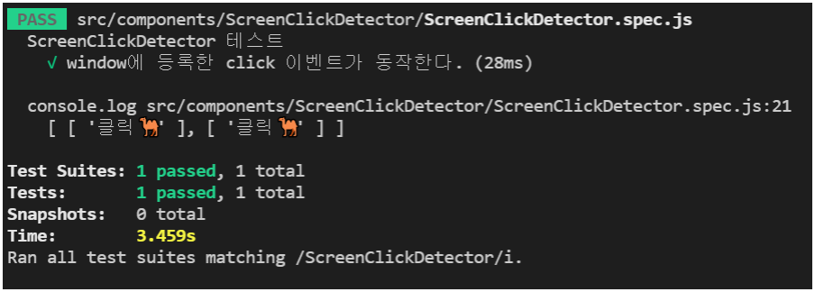

# Vue ``TestUtils`` 연습 및 활용 정리

``jest`` 와 ``@vue/test-utils` 를 사용한 컴포넌트 테스트 유닛 활용에 대한 정리 입니다.

테스트하고자 하는 컴포넌트에 적합한 ``wrapper`` 를 만드는 것이 테스트 유닛 작성의 핵심이라고 생각되어, 활용 방법에 대해 정리하게 되었습니다.


<br/><hr/><br/>


## 설정

간편한 테스트를 위해, ``jest`` 의 대상 파일 설정을 변경 하였습니다.

추가한 설정은 다음과 같습니다.

* ``jest.config.js`` : ``testMatch`` 추가
* ``.eslintrc.js`` : ``env.jest`` 추가

<br/>

```javascript
// jest.config.js

module.exports = {
  // 기본 설정
  preset: "@vue/cli-plugin-unit-jest",

  // 추가한 설정
  testMatch: [
    "**/__tests__/**/*.[jt]s?(x)", 
    "**/?(*.)+(spec|test).[jt]s?(x)"
  ],
};
```

<br/>

```javascript
// .eslintrc.js

modules.exports = {
  // 기본 설정
  root: true,

  // 추가한 설정
  env: {
    // 기본 설정
    node: true,

    // 추가한 설정 (jest 환경 사용여부)
    jest: true,
  },

  // ... 생략
}
```

<br/>

추가로, ``ESLint`` 가 ``root`` 파일은 적용되지 않도록 ``ignore`` 을 적용하면 다음과 같습니다.

```javascript
// .eslintrc.js

module.exports = {
  // ... 생략

  ignorePatterns: [
    "/*.js",
    "/*.ts",
    "/*.jsx",
    "/*.tsx",
  ]
}
```


<br/><hr/><br/>


# 01. ``shallowMount()`` 를 사용한 컴포넌트 테스트

```html
<!-- MyTitle.vue -->

<template>
  <h2
    class="myTitle"
    :style="{
      color: color,
      'background-color': bgColor,
    }"
  >
    {{ title }}
  </h2>
</template>

<script>
export default {
  props: {
    title: {
      type: String,
      default: "",
    },

    color: {
      type: String,
      default: "#383841",
    },

    bgColor: {
      type: String,
      default: "inherit",
    },
  },
};
</script>
```

<br/>

```javascript
// MyTitle.spec.js

import MyTitle from "./MyTitle.vue";
import { shallowMount } from "@vue/test-utils";

const generateWrapper = propsData => {
  return shallowMount(MyTitle, {
    propsData,
  });
};

describe("MyTitle 컴포넌트 테스트", () => {
  describe("props 테스트", () => {
    describe("props default value 테스트", () => {
      it("title 기본값 === ''", () => {
        const wrapper = generateWrapper();

        expect(wrapper.vm.title).toBe("");
      });

      it("color 기본값 === '#383841'", () => {
        const wrapper = generateWrapper();

        expect(wrapper.vm.color).toBe("#383841");
      });

      it("bgColor 기본값 === 'inherit'", () => {
        const wrapper = generateWrapper();

        expect(wrapper.vm.bgColor).toBe("inherit");
      });
    });

    describe("props value 테스트", () => {
      it("title props가 반영된다.", () => {
        const wrapper = generateWrapper({ title: "테스트 타이틀" });

        expect(wrapper.vm.title).toBe("테스트 타이틀");
      });

      it("color props가 반영된다.", () => {
        const wrapper = generateWrapper({ color: "#03a9f4" });

        expect(wrapper.vm.color).toBe("#03a9f4");
      });

      it("bgColor props가 반영된다.", () => {
        const wrapper = generateWrapper({ bgColor: "#ff1493" });

        expect(wrapper.vm.bgColor).toBe("#ff1493");
      });
    });
  });
});
```


<br/><hr/><br/>


# 02. ``jest.spyOn()`` 을 사용한, 컴포넌트의 ``Event Listener`` 동작 여부 테스트

컴포넌트에 이벤트를 발생시키면 동작하는 ``Event Listener`` 를 테스트 할 수 있습니다.

특정 ``Event Listener`` 가 호출 되었는지를 테스트 하기 위해서는 ``jest.spyOn()`` 을 사용하여, 호출 여부를 사용할 수 있습니다.

원리는 테스트 대상 컴포넌트에 ``특정 Event`` 를 발생시킨 후, 호출되어야 하는 ``Event Listener`` 가 호출 되었는지 확인하는 것입니다.

<br/>

``jest.spyOn()`` 을 사용할 때는 주의할 점이 있습니다.

``Vue 컴포넌트`` 를 ``mount()`` 또는 ``shallowMount()`` 로 생성하기 전에 ``jest.spyOn()`` 을 호출해야 합니다.

즉, ``jest.spyOn()`` 을 사용하기 위한 흐름은 다음과 같습니다.

1. ``Vue 컴포넌트`` 의 특정 메서드에 ``jest.spyOn()`` 을 실행
2. ``wrapper`` 생성 - (``mount()`` 또는 ``shallowMount()`` 호출)
3. ``jest.spyOn()`` 으로 생성한 ``spy객체`` 파괴 (``spy객체.mockRestore()``)

<br/>

```html
<!-- MyButton.vue -->

<template>
  <button class="myButton" @click="onClick">
    {{ name }}
  </button>
</template>

<script>
export default {
  props: {
    name: {
      type: String,
      default: "버튼",
    },
  },

  methods: {
    onClick() {
      this.$emit("click");
    },
  },
};
</script>
```

<br/>

```javascript
import MyButton from "./MyButton.vue";
import { shallowMount } from "@vue/test-utils";

const generateWrapper = propsData => {
  return shallowMount(MyButton, {
    propsData,
  });
};

describe("MyButton 테스트", () => {
  describe("Event 호출여부 테스트", () => {
    it("click시, EventListener가 호출된다.", () => {
      const onClickSpy = jest.spyOn(MyButton.methods, "onClick");

      const wrapper = generateWrapper();
      wrapper.trigger("click");
      wrapper.trigger("click");

      expect(onClickSpy).toBeCalled();
      onClickSpy.mockRestore();
    });
  });
});
```


<br/><hr/><br/>


# 03. 컴포넌트에서 발생한 ``Event`` 테스트

이 테스트는 컴포넌트에서 ``Event`` 가 발생했는지 테스트하는 방법입니다.

위의 테스트와 다른 점은 ``컴포넌트에서 emit()`` 되는 ``Event`` 를 검사하는 것입니다.

(위의 테스트는 컴포넌트에 이벤트를 발생시켜주었을 때 테스트 입니다.)

<br/>

이번 테스트는 ``wrapper`` 에서 제공하는 ``wrapper.emitted()`` 사용하여 테스트 할 수 있습니다.

```html
<!-- MyButton.vue (위의 MyButton.vue 와 동일) -->

<template>
  <button class="myButton" @click="onClick">
    {{ name }}
  </button>
</template>

<script>
export default {
  props: {
    name: {
      type: String,
      default: "버튼",
    },
  },

  methods: {
    onClick() {
      this.$emit("click");
    },
  },
};
</script>
```

<br/>

```javascript
// MyButton.spec.js

import MyButton from "./MyButton.vue";
import { shallowMount } from "@vue/test-utils";

const generateWrapper = propsData => {
  return shallowMount(MyButton, {
    propsData,
  });
};

describe("MyButton 테스트", () => {
  describe("Event 호출여부 테스트", () => {
    it("click시, 'click' 이벤트가 발생된다.", () => {
      const wrapper = generateWrapper();

      wrapper.trigger("click");

      const emittedClick = wrapper.emitted()["click"];

      expect(emittedClick).not.toBeUndefined();
    });
  });
});
```

<br/>

``wrapper.emitted()`` 를 실행하면, ``{ "이벤트명": [] }`` 형식의 객체를 반환 합니다.

``["click"]`` 으로 Property에 접근하게되면 배열을 가지고 있는데, 이는 이벤트가 발생한 순서대로 넘겨받은 ``데이터 (Primitive, Object, Array...)`` 를 가지고 있습니다.

그러므로, 컴포넌트에서 발생한 ``Event 횟수``, ``넘겨받은 데이터`` 를 직접 테스트 할 수 있습니다.


<br/><hr/><br/>


# 04. ``window`` 객체에 이벤트 발생시키고 ``Event Listener`` 호출여부 테스트 하기

화면 전체에 대한 이벤트를 사용할 때, ``window.addEventListener()`` 를 사용할 수 있습니다.

``window``는 ``Vue 컴포넌트``는 아니므로, ``wrapper``를 만들어 테스트할 수 없습니다.

그러므로, ``wrapper.trigger("이벤트")``는 사용할 수 없으므로, ``jest.spyOn()``으로 테스트할 수 있습니다.

<br/>

더욱 중요한 것은, ``window``객체에 어떻게 ``Event``를 발생시킬 것인가 입니다.

이는 ``window.dispatchEvent(new ___Event("이벤트명", { 함꼐 넘겨줄 데이터 }))`` 형식으로 발생시킬 수 있습니다.

  * ``___Event()`` 는 구체적인 ``Event Class`` 를 사용하여 객체를 생성해 줍니다.
  * ``"이벤트명"``은 발생시킬 이벤트명이며, ``MouseEvent`` 에서는 ``"click"`` 이 하나의 예시가 될 수 있습니다.

<br/>

위와같이 ``window.dispatchEvent()`` 를 사용하면, ``mousemove`` 이벤트도 발생시킬 수 있으며, ``함께 넘겨줄 데이터`` 를 사용하여 마우스의 위치까지 지정할 수 있습니다.

<br/>

아래의 코드는 ``window`` 에 ``click`` 이벤트가 발생했을 때의 테스트 입니다.

```html
<template>
  <div>스크린을 클릭 하세요.</div>
</template>

<script>
export default {
  methods: {
    clickHandler() {
      this.$emit("click", "클릭🐫");
    },
  },

  mounted() {
    window.addEventListener("click", this.clickHandler);
  },

  beforeDestroy() {
    window.removeEventListener("click", this.clickHandler);
  },
};
</script>
```

<br/>

```javascript
import ScreenClickDetector from "./ScreenClickDetector.vue";
import { shallowMount } from "@vue/test-utils";

const generateWrapper = () => {
  return shallowMount(ScreenClickDetector);
};

describe("ScreenClickDetector 테스트", () => {
  it("window에 등록한 click 이벤트가 동작한다.", () => {
    const clickHandlerSpy = jest.spyOn(
      ScreenClickDetector.methods,
      "clickHandler",
    );

    const wrapper = generateWrapper();

    window.dispatchEvent(new MouseEvent("click"));
    window.dispatchEvent(new MouseEvent("click"));
    expect(clickHandlerSpy).toBeCalled();

    console.log(wrapper.emitted()["click"]);

    clickHandlerSpy.mockRestore();
    wrapper.destroy();
  });
});
```

<br/>

위의 이벤트 결과, ``console.log(wrapper.emitted()["click"])`` 의 결과를 보면, 이벤트와 함께 받게된 데이터까지 확인할 수 있습니다.

<br/>


<br/><hr/><br/>


# 05. ``Router`` 테스트

``Router`` 이동 시, ``router 객체``에 의도한 값이 들어가 있는지 테스트를 할 수 있습니다.

``Router``의 테스트에는 특이한 점이 있는데, ``await wrapper.vm.$nextTick()`` 을 두번 호출해야 정상적인 동작을 기대할 수 있습니다.

이유는 다음과 같습니다.

* 호출하지 않을 시: ``Router`` 가 아직 동작하지 않은 상태의 값이 나타납니다.
* 1번만 호출 시: 간헐적으로 테스트 실패가 됩니다. (마치 호출하지 않은 것과 같은 상태)

<br/>

``await wrapper.vm.$nextTick()`` 을 고려하여 작성하면, 다음과 같은 흐름이 됩니다.
1. ``wrapper`` 생성
2. ``wrapper.vm.$router.push()`` 호출
3. ``await wrapper.vm.$nextTick()`` 2번 호출
4. ``expect()`` 로 테스트 수행

<br/>

아래의 코드는 ``@/router/index.js`` 의 테스트 코드 예시 입니다.

```javascript
import Vue from "vue";
import VueRouter from "vue-router";

Vue.use(VueRouter);

const routes = [
  {
    path: "/",
    children: [
      {
        path: "/:id",
        name: "HomeID",
        component: () => import("@/views/Home.vue"),
      },
      {
        path: "",
        name: "Home",
        component: () => import("@/views/Home.vue"),
      },
    ],
  },
  {
    path: "/about",
    name: "About",
    component: () => import("../views/About.vue"),
  },
];

const router = new VueRouter({
  mode: "history",
  base: process.env.BASE_URL,
  routes,
});

export default router;
```

<br/>

```javascript
// router.spec.js

import router from "./";
import VueRouter from "vue-router";
import { createLocalVue, shallowMount } from "@vue/test-utils";

const localVue = createLocalVue();
localVue.use(VueRouter);

const generateWrapper = () => {
  return shallowMount(
    {
      template: `
        <div>
          <div class="name">{{ $route.name }}</div>
          <div class="path">{{ $route.path }}</div>
          <div class="params">{{ $route.params }}</div>
          <div class="query">{{ $route.query }}</div>
        </div>
      `,
    },
    {
      localVue,
      router,
    },
  );
};

describe("Router 테스트", () => {
  it("기본 Route가 동작한다.", async () => {
    const wrapper = generateWrapper();

    // router.push({ path: "/" }) 의 mounted 시점까지 대기
    await wrapper.vm.$nextTick();
    // localVue의 mounted 시점까지 대기
    await wrapper.vm.$nextTick();

    // 총 2번의 vm.$nextTick() 이 있어야 router의 값이 정상적으로 반영된다.

    const nameWrapper = wrapper.find(".name");
    const pathWrapper = wrapper.find(".path");
    const paramsWrapper = wrapper.find(".params");
    const queryWrapper = wrapper.find(".query");

    expect(nameWrapper.text()).toBe("Home");
    expect(pathWrapper.text()).toBe("/");
    expect(paramsWrapper.text()).toBe(JSON.stringify({}));
    expect(queryWrapper.text()).toBe(JSON.stringify({}));
  });

  it("About Route가 동작한다.", async () => {
    const wrapper = generateWrapper();

    wrapper.vm.$router.push({
      name: "About",
    });

    await wrapper.vm.$nextTick();
    await wrapper.vm.$nextTick();

    const nameWrapper = wrapper.find(".name");
    const pathWrapper = wrapper.find(".path");
    const paramsWrapper = wrapper.find(".params");
    const queryWrapper = wrapper.find(".query");

    expect(nameWrapper.text()).toBe("About");
    expect(pathWrapper.text()).toBe("/about");
    expect(paramsWrapper.text()).toBe(JSON.stringify({}));
    expect(queryWrapper.text()).toBe(JSON.stringify({}));
  });

  it("/home/:id ROuter의 params.id 가 정상 반영된다.", async () => {
    const wrapper = generateWrapper();

    wrapper.vm.$router.push({
      name: "HomeID",
      params: {
        id: 333,
      },
    });

    await wrapper.vm.$nextTick();
    await wrapper.vm.$nextTick();

    const nameWrapper = wrapper.find(".name");
    const pathWrapper = wrapper.find(".path");
    const paramsWrapper = wrapper.find(".params");
    const queryWrapper = wrapper.find(".query");

    expect(nameWrapper.text()).toBe("HomeID");
    expect(pathWrapper.text()).toBe("/home/333");
    expect(JSON.parse(paramsWrapper.text())).toEqual({ id: 333 });
    expect(JSON.parse(queryWrapper.text())).toEqual({});
  });
});
```


<br/><hr/><br/>


# 06. ``slots`` 테스트

테스트 대상 컴포넌트의 ``Slot`` 을 테스트 할 때는, ``@vue/test-utils`` 의 ``mountOptions`` 에 ``slots`` 속성을 사용합니다.

``slots`` 테스트는 단순 ``<template />`` 검사로 할 수 있습니다.

<br/>

```html
<!-- MySlotCard.vue -->

<template>
  <div class="mySlotCard">
    <header class="mySlotCard-header">
      <slot name="title">
        <h1 class="mySlotCard-header-title">{{ title }}</h1>
      </slot>
    </header>

    <section class="mySlotCard-content" @click="onClick">
      <slot>
        <div class="mySlotCard-content-text">
          {{ content }}
        </div>
      </slot>
    </section>

    <footer class="mySlotCard-footer">
      <slot name="footer">
        {{ footer }}
      </slot>
    </footer>
  </div>
</template>

<script>
export default {
  props: {
    title: {
      type: String,
      default: "",
    },

    content: {
      type: String,
      default: "",
    },

    footer: {
      type: String,
      default: "",
    },
  },

  methods: {
    onClick() {
      const { title, content, footer } = this;

      this.$emit("click", {
        title,
        content,
        footer,
      });
    },
  },
};
</script>

<style scoped lang="scss">
.mySlotCard {
  &-header {
    &-title {
      text-shadow: 0 3px 6px #f0f400;
    }
  }

  &-content {
    margin: 10px 0;

    &-text {
      color: #ff1493;
    }
  }

  &-footer {
    color: #383841;
    font-size: 0.825rem;
    font-weight: 900;
  }
}
</style>
```

<br/>

```javascript
// MySlotCard.spec.js

import MySlotCard from "./MySlotCard.vue";
import { shallowMount } from "@vue/test-utils";

const generateWrapper = propsData =>
  shallowMount(MySlotCard, {
    propsData,

    // MySlotCard 에 전달할 slot 정의 
    slots: {
      title: `<div class="mySlotCard-header-title">Slot 제목</div>`,
      default: `<div class="mySlotCard-content-text">Slot 컨텐츠</div>`,
      footer: `<div class="mySlotCard-footer">Slot 푸터</div>`,
    },
  });

describe("MySlotCard 테스트", () => {
  it("title slot이 동작한다.", () => {
    const wrapper = generateWrapper({ title: "제목 🐫" });

    expect(wrapper.find(".mySlotCard-header-title").text()).toBe("Slot 제목");
  });

  it("default slot이 동작한다.", () => {
    const wrapper = generateWrapper();

    expect(wrapper.find(".mySlotCard-content-text").text()).toBe("Slot 컨텐츠");
  });

  it("footer slot이 동작한다.", () => {
    const wrapper = generateWrapper();

    expect(wrapper.find(".mySlotCard-footer").text()).toBe("Slot 푸터");
  });
});
```


<br/><hr/><br/>


## 07. ``ScopedSlot`` 테스트

``ScopedSlot`` 은 해당 ``slot`` 이 정의된 스코프의 ``데이터`` 를 받아올 수 있습니다.

주로 컴포넌트 내부에서 ``v-for`` 와 같은 플로우 내부에 정의한 ``slot`` 을 ``ScopedSlot`` 으로 만듭니다.

이를 테스트하기 위해서는 ``@vue/test-utils`` 에서 제공하는 ``mountOptions`` 의 ``scopedSlots`` 필드를 사용합니다.

<br/>

``mountOptions.scopedSlots`` 속성의 기본 사용방법은 다음과 같습니다.

```javascript
import { shallowMount } from "@vue/test-utils";
import MySlotList from "./MySlotList.vue";

const wrapper = shallowMount(MySlotList, {
  scopedSlots: {
    default: "default slot 정의",
    슬롯명: "named slot 정의",
  },
});
```

<br/>

``slot 정의`` 는 3가지 방법을 지원합니다.

* ``문자열`` 방식
* ``JSX 함수`` 방식
* ``this.$createElement()`` 방식

아래 정리한 방법은 ``문자열 방식`` 과 ``JSX 방식`` 입니다.

<br/>

## 07-01. ``일반 문자열`` 로 scopedSlot 정의

일반 문자열을 사용하여 ``scopedSlot``을 정의할 수 있습니다.

이 경우, ``scopedSlot`` 에서 받는 데이터는 ``props`` 르 사용하여 접근할 수 있습니다.

```javascript
import { shallowMount } from "@vue/test-utils";
import MySlotList from "@vue/test-utils";

const wrapper = shallowMount(MySlotList, {
  scopedSlots: {
    default: "<div class='defaultSlot'>{{ props.속성명 }}</div>",

    슬롯명: "<div>{{ props.속성명 }}</div>",
  },
});
```

<br/>

## 07-02. ``JSX 함수`` 로 scopedSlot 정의

``JSX`` 형식의 함수로도 ``scopedSlot`` 을 작성할 수 있습니다.

가장 가독성이 좋다고 생각합니다.

* 주의할 점은 ``scopedSlot`` 메서드를 정의할 때, ``() => {}`` 으로 작성 시, 정상동작 하지 않습니다. (``function`` 으로 정의하기)

```javascript
import { shallowMount } from "@vue/test-utils";
import MySlotList from "./MySlotList.vue";

const wrapper = shallowMount(MySlotList, {
  scopedSlots: {
    default({ title }) {
      return <div class="defaultSlot">{title}</div>;
    },

    슬롯명(props) {
      return <div>{props.속성명}</div>;
    },
  },
});
```

<br/>

## 07-03. scopedSlot 테스트 코드

위의 방법들을 사용하여 ``scopedSlots`` 를 테스트하면 다음과 같습니다.

```html
<!-- MyScopedSlotList.vue -->

<template>
  <div class="myScopedSlotList">
    <header class="myScopedSlotList-header">
      <slot name="title" :title="title">
        <h1 class="myScopedSlotList-header-title">
          {{ title }}
        </h1>
      </slot>
    </header>

    <ul class="myScopedSlotList-list">
      <li v-for="(item, idx) in items" :key="idx">
        <slot :item="item">
          <div class="myScopedSlotList-list-item">
            <small>{{ item.id }}</small>
            {{ item.text }}
          </div>
        </slot>
      </li>
    </ul>

    <footer class="myScopedSlotList-footer">
      <slot name="footer" :footer="footer">
        {{ footer }}
      </slot>
    </footer>
  </div>
</template>

<script>
export default {
  props: {
    title: {
      type: String,
      default: "",
    },

    items: {
      type: Array,
      default: () => [],
    },

    footer: {
      type: String,
      default: "",
    },
  },
};
</script>
```

<br/>

```javascript
// MyScopedSlotList.spec.js

import MyScopedSlotList from "./MyScopedSlotList.vue";
import { shallowMount } from "@vue/test-utils";

const generateWrapper = propsData =>
  shallowMount(MyScopedSlotList, {
    propsData,

    scopedSlots: {
      title: "<div class='test-title'>{{ props.title }}</div>",

      default({ item }) {
        return (
          <div class="test-item">
            {item.id}-{item.text}
          </div>
        );
      },

      footer({ footer }) {
        return <div class="test-footer">🐫 {footer}</div>;
      },
    },
  });

const propsData = {
  title: "테스트 제목",
  items: [
    {
      id: 1000,
      text: "테스트 컨텐츠 🐫",
    },
    {
      id: 2000,
      text: "테스트 컨텐츠 🐫🐫",
    },
    {
      id: 3000,
      text: "테스트 컨텐츠 🐫🐫🐫",
    },
  ],

  footer: "테스트 푸터 🚀",
};

describe("MyScopedSlotList 테스트", () => {
  it("title slot이 동작한다.", () => {
    const wrapper = generateWrapper(propsData);

    expect(wrapper.find(".test-title").text()).toBe("테스트 제목");
  });

  it("item slot이 동작한다.", () => {
    const wrapper = generateWrapper(propsData);
    const itemWrappers = wrapper.findAll(".test-item");

    expect(itemWrappers.at(0).text()).toBe("1000-테스트 컨텐츠 🐫");
    expect(itemWrappers.at(1).text()).toBe("2000-테스트 컨텐츠 🐫🐫");
    expect(itemWrappers.at(2).text()).toBe("3000-테스트 컨텐츠 🐫🐫🐫");
  });

  it("footer slot이 동작한다.", () => {
    const wrapper = generateWrapper(propsData);
    const footerWrapper = wrapper.find(".test-footer");

    expect(footerWrapper.text()).toBe("🐫 테스트 푸터 🚀");
  });
});
```


<br/><hr/><br/>


[이전 페이지로 이동](https://github.com/Chocobe/-Study-Vue-Test-Utils)
